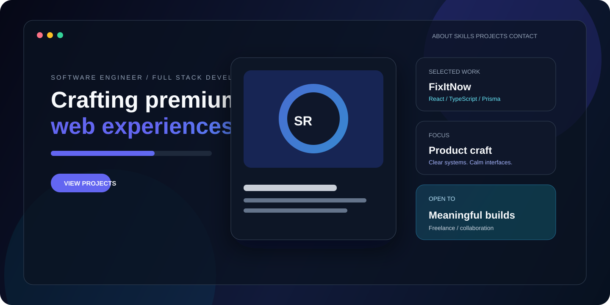

# Sheikh Raski Rayhan | Portfolio

[](https://raskirayhan.github.io/portfolio/)
[](https://github.com/raskirayhan/portfolio/actions)
[](LICENSE)

> A dark, responsive portfolio for Sheikh Raski Rayhan, a full-stack developer building clear interfaces, practical APIs, and product-minded web experiences.

<p align="center">
  
</p>

<p align="center">
  
</p>

<p align="center">
  <a href="profile/README.md">Profile README source</a> ·
  <a href="https://github.com/raskirayhan">GitHub profile</a> ·
  <a href="mailto:raskirayhan@gmail.com">Contact</a>
</p>



## What this is

This repository combines a static portfolio frontend with a small Express API that supplies the featured project catalog. The frontend works without the API by falling back to a curated static catalog, so the GitHub Pages deployment remains useful even when the local backend is offline.

## Highlights

- Responsive dark-theme portfolio with motion, accessible landmarks, and reduced-motion-friendly CSS.
- Project showcase with screenshots, technology tags, live demos, and repository links.
- Small Express API for project data and service health checks.
- Node's built-in test runner for API smoke tests.
- GitHub Actions for validation and GitHub Pages deployment.
- Maintainer documentation for contributions, security reports, conduct, releases, and support.

## Stack

| Layer | Tools |
| --- | --- |
| Frontend | HTML, CSS, vanilla JavaScript, Swiper |
| Backend | Node.js, Express, CORS |
| Design | Dark glassmorphism, responsive CSS, motion principles |
| Delivery | GitHub Pages for the static site; any Node-compatible host for the API |
| Quality | Node test runner, syntax checks, GitHub Actions |

## Run locally

### Preview the static site

Open `index.html` directly for a quick preview, or serve the repository with any static server:

```bash
npx serve .
```

### Run the project catalog API

```bash
cd backend
npm ci
npm start
```

The API runs at `http://localhost:4000`. With the API running, the frontend loads projects from `/api/projects`; otherwise it uses the static fallback catalog.

### Validate the backend

```bash
cd backend
npm run validate
```

The validation command checks JavaScript syntax and exercises `/api/status` and `/api/projects` with an ephemeral HTTP server.

## API

| Method | Route | Purpose |
| --- | --- | --- |
| `GET` | `/api/status` | Service health response |
| `GET` | `/api/projects` | Curated project catalog |

The server reads `PORT` when provided and defaults to `4000`.

## Architecture

```text
index.html + styles.css + script.js
              |
              | fetches when available
              v
       backend/server.js
              |
              v
       /api/projects
```

<details>
<summary>Repository map</summary>

```text
portfolio/
├── assets/                 # Profile and downloadable resume assets
├── backend/
│   ├── server.js           # Express app and project catalog
│   └── test/server.test.js # API smoke tests
├── docs/                   # Lightweight documentation assets
├── image/                  # Project preview images
├── profile/                # Publish-ready GitHub profile README source
├── index.html              # Portfolio page structure
├── script.js               # Interactions and project rendering
├── styles.css              # Responsive dark visual system
└── .github/                # CI, deployment, issue, and maintainer config
```
</details>

## Featured work

The portfolio currently highlights work that is publicly verifiable on GitHub:

- [FixItNow-](https://github.com/raskirayhan/FixItNow-) - full-stack home-services marketplace with React, TypeScript, Express, Prisma, PostgreSQL, authentication, payments, and Swagger documentation.
- [Habit Tracker](https://github.com/raskirayhan/habit-tracker) - responsive habit-building product with Firebase authentication and a hosted frontend.
- [Flower Website](https://github.com/raskirayhan/flower-website) - responsive flower storefront concept.
- [G3 Architects](https://github.com/raskirayhan/g3-architect-website-repo) - architecture studio landing page.
- [Webflow Agency](https://github.com/raskirayhan/webflow-agency) - dark agency landing page; its current Pages URL needs deployment-source cleanup before it can be presented as a live demo.

## Documentation

- [Contribution guide](CONTRIBUTING.md)
- [Security policy](SECURITY.md)
- [Code of conduct](CODE_OF_CONDUCT.md)
- [Changelog](CHANGELOG.md)
- [Profile README source](profile/README.md)

## Roadmap

- Add a deployed API URL and a production contact form provider.
- Replace placeholder project metrics with measured Lighthouse and accessibility results.
- Add case-study pages with decisions, trade-offs, and outcomes for the strongest projects.
- Add visual regression checks once the frontend has a stable component boundary.

## License

Released under the [MIT License](LICENSE).

## Author

Sheikh Raski Rayhan · [GitHub](https://github.com/raskirayhan) · [LinkedIn](https://www.linkedin.com/in/sheikh-raski-rayhan-36b588334/) · [Email](mailto:raskirayhan@gmail.com)
